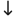
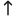

# Icons

To add a new icon, it needs to be standardized before adding the single SVG path here. To be considered standardized, it needs to be positioned centered, vertically and horizontally, on a 16x16px canvas and be a single SVG path.

1. Ensure the icon is designed on a 16x16 canvas. You could check and adjust at [Method Draw](https://editor.method.ac/). Export the path from that file.

2. Import the source code into an SVG optimizer, such as [SVGOMG](https://jakearchibald.github.io/svgomg/). The icons here are rounded to precision 3.

3. In some cases the designer may have used a shape element and not converted it to a path. In this case, an image editing client such as Inkscape or [GIMP](https://www.gimp.org/downloads/) would need to be used to import the image and convert the object to a path. The path would then need to replace the shape in the source image manually.

4. In some cases, the scale is too large, Inkscape or GIMP have the ability to lock the aspect ratio and scale accordingly.

# Available Icons
ArrowDown:  

ArrowUp:    

CaretDown:  

CaretUp:  

ChevronLeft:  

ChevronRight:  

FirstPage:  

LastPage:  

Search:  

Sort:  
